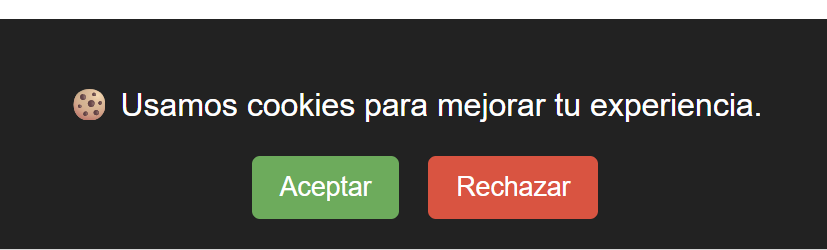
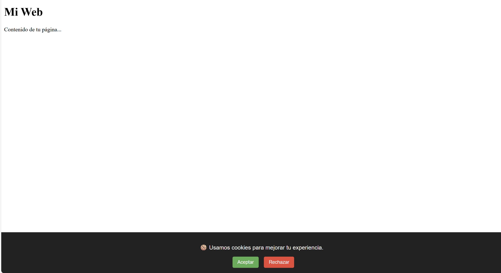

# Banner de consentimiento de cookies

Este pequeño ejemplo muestra un banner de consentimiento de cookies sencillo y listo para integrar en una web estática.

## ¿Qué ofrece?
- Informa al usuario sobre el uso de cookies (mensaje visible en el banner).
- Permite al usuario Aceptar o Rechazar las cookies.
- Guarda la preferencia en una cookie llamada `consentimientoCookies` durante 365 días.
- Oculta el banner cuando el usuario ya ha tomado una decisión.

## Cómo funciona (resumen técnico)
- `index.html`: HTML mínimo que incluye el `div` del banner con los botones.
- `style.css`: estilos que fijan el banner en la parte inferior de la página y definen la apariencia de los botones.
- `script.js`: funciones para crear/leer cookies y lógica para mostrar/ocultar el banner:
	- Al cargar la página se comprueba la cookie `consentimientoCookies`.
	- Si no existe, se muestra el banner.
	- Al aceptar o rechazar, se crea la cookie con valor `aceptado` o `rechazado` (365 días) y se oculta el banner.
    

## Archivos principales
- `index.html` — estructura HTML y el `div` del banner.
- `style.css` — estilos del banner y botones.
- `script.js` — gestión de cookies y eventos de los botones.

## Integración rápida
1. Copia los tres archivos (`index.html`, `style.css`, `script.js`) a tu proyecto.
2. Inserta el `div` del banner en el HTML si no está ya presente.
3. Asegúrate de enlazar `style.css` y `script.js` correctamente en tu HTML.

## Mejoras recomendadas
- Reemplazar `alert()` por confirmaciones inline o un pequeño toast para mejorar la UX.
- Añadir atributos ARIA y manejo de foco para mejorar la accesibilidad.
- Ofrecer opciones granulares de consentimiento (p. ej. funcionales vs analíticas vs marketing).
- Añadir un panel o enlace para cambiar o borrar la preferencia de cookies.

## Notas legales
Este ejemplo no es asesoramiento legal. Adapta el texto y el comportamiento para cumplir la normativa aplicable (GDPR u otras leyes locales) si tu sitio lo requiere.

